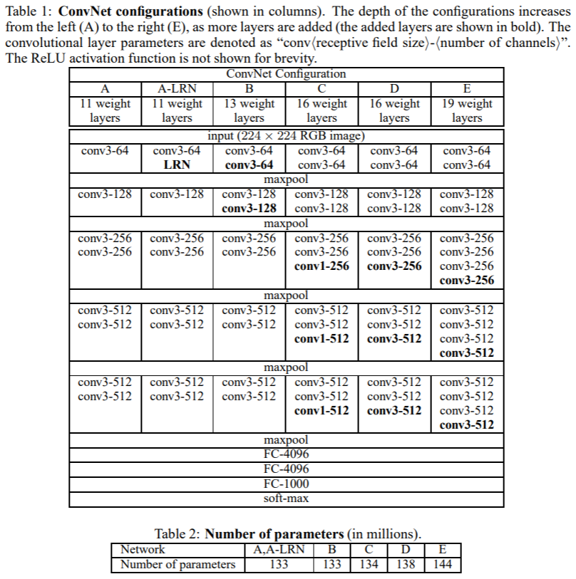

# VGG

## 参考文献

### 論文

Very Deep Convolutional Networks for Large-Scale Image Recognition

<https://arxiv.org/abs/1409.1556>

### モデルなど

- <http://www.robots.ox.ac.uk/~vgg/research/very_deep/>
- <https://keras.io/ja/applications/#vgg16>

## 内容

### 概要

- カーネルのサイズが非常に小さな (`3 * 3`) 畳み込み層を `16 ~ 19` 層重ねることで, 画像認識の精度が大幅に向上する。
  - 従来のものは, 最初の畳み込み層で比較的大きなカーネルサイズを利用していた。(e.g. カーネルサイズ: `11 * 11`, ストライド: `4`)
- 学習済みのモデルが公開されている。

### 構造

- 入力: `224 px * 224 px` の RGB 画像
- 前処理: 入力である ImageNet の画像全体の平均 RGB 値 (`[103.939, 116.779, 123.68]`) を, 各ピクセルから引く
  - <https://www.tensorflow.org/api_docs/python/tf/keras/applications/vgg16/preprocess_input>
  - <https://github.com/tensorflow/tensorflow/blob/v2.3.0/tensorflow/python/keras/applications/imagenet_utils.py#L208-L211>
- 畳み込み層(conv):
  - カーネルサイズは基本的に `3 * 3` (`1 * 1` を使うこともある)
    - `3 * 3` は「左/右, 上/下, 中央」の概念を捉えるための最小サイズ
    - 畳み込みの後には非線形な活性化関数を適用するため, `1 * 1` の畳み込み層は非線形性を追加する働きを持つ。
  - ストライドは 1
  - 深さはモデルにより異なる
- プーリング:
  - 合計 5 つで, 全て最大値プーリング
  - カーネルサイズは `2 * 2`
  - ストライドは 2
- 全結合層(fc): 畳み込み層の後に続く
  - 第 1, 2 層: 4096 チャンネル(サイズは1)
  - 第 3 層: 1000 チャンネル(サイズは1): 目的が 1000 分類のため
- 活性化関数: 最後の層はソフトマックス関数, それ以外は ReLU

構造の詳細は下表の Table.1 の通りである。ただし, `conv3-256` はカーネルサイズが 3 * 3 で, 出力のチャンネル数が 256 であることを表す。

Table.2 は学習する重みの個数であり, VGG19 で 1.44 億個と深さの割に多くはない。

なお, [局所応答正規化](http://www.cs.toronto.edu/~hinton/absps/imagenet.pdf) (n 個の近傍の特徴マップ(チャンネル)間で, 同じ位置にあるピクセルについて正規化する) を行っても精度は向上せず, メモリ消費と時間時間が増えるだけなので行わなかった。

### 考察

重みの個数が少なく精度が良い理由として, 次のことが考えられる。

`7 * 7` の大きさの受容野の畳み込み層(入出力のチャンネル数を $ C $ とする)の実現方法として, 次の 2 つの方法が挙げられる。

- 方法1: カーネルサイズが `7 * 7` の単一の畳み込み層を使用する。
- 方法2: カーネルサイズが `3 * 3` の畳み込み層を 3 つ重ねる。
  - 各層で受容野が上下左右に 1 だけ受容野が広がるため, 最終的な受容野は `7 * 7` になる。

方法 2 は方法 1 と比較して, 次のメリットがある。

- 方法 1 と方法 2 の重みの個数はそれぞれ $ 7 \cdot 7 \cdot C^2 = 49C^2 $ と $3 \cdot 3 \cdot C^2 \cdot 3 = 27C^2$ であり, 方法 2 のほうが重みの個数が少ない。
- 方法 2 は各畳み込み層の後に非線形関数を適用するため, 精度が向上する。

### 訓練方法

- 120 万枚の画像を 1000 クラスに分類 (多項ロジスティック回帰)
- ミニバッチ勾配降下法 (バッチサイズ: 256)
  - モーメンタム法 (減衰率: 0.9)
  - 学習率:
    - 初期値は 0.01
    - 検証集合に対して改善が見られなくなった後, 学習率を減衰させる(factor: 0.1)
    - <https://www.tensorflow.org/api_docs/python/tf/keras/callbacks/ReduceLROnPlateau>
- 重みは $ L_2 $ 正則化 (係数: $ 5\cdot 10^{-4} $)
- 全結合層のうち, 最初の 2 つをドロップアウト (ドロップアウト率: 0.5)

収束までのエポック数が少ない理由として, 次の 2 つが考えられる。

- ネットワークの深さと畳み込みカーネルの小ささにより, 暗黙的に正則化されたため。
- 一部の層で重みを事前学習した値で初期化したため。(深層ネットワークの勾配は不安定であるため, 重みの初期化が不適切であると, 学習が停滞する可能性がある。)
  - 最初にランダムな重みで前表 Table.1 の ネットワークA (一番浅いもの) を学習し, その後, より深いネットワークを学習するときに, 最初の 4 つの畳み込み層と最後の 3 つの全結合層をネットワークA の層で初期化した(中間層はランダムに初期化)。

また, 入力画像は次の方法で取得される。

- 最初に入力画像の短いほうの辺のピクセル数が $ S $ になるように等方的に画像をスケーリングする。
  - ここでは, $ S = 256 $ (学習率は 0.01) で事前学習し, その重みを使って $ S = 384 $ で学習 (学習率は 0.001) した。
    - 一般に, $ S \geq 224 $ であれば良いが, $ S = 256, 384 $ がよく使われる。
    - また, $ S \in [256, 512] $ からランダムに選択すると, 画像内のオブジェクトのサイズが画像により異なることが考慮されたネットワークになる。
- 次に, ランダムに `224 * 224` の領域を切り出す
- 最後に, ランダムに水平方向の反転と, RGB カラーシフトを行う。

### テスト方法

- まず, 画像の短い辺のピクセル数が $ Q $ となるよう, 等方的に再スケーリングする。$ Q $ は $ S $ と等しい必要はなく, いくつかの値を試すとよい。
- 次にネットワークの全結合層を畳み込み層に変換する。ただし, 変換するとあるが, (おそらく)本質的には変化しない。以下, 1 層目の例である。
  - 変換前: `[batch, 7, 7, 512]` を `[batch, 25088]` に平滑化したのち, 全結合層で `[batch, 4096]` に変換する。
  - 変換後: `[batch, 7, 7, 512]` を `kernel_size=7`, `strides=(1, 1)`, `padding='valid'` の畳み込み層を用いて `[batch, 1, 1, 4096]` に変換する。(入力のサイズとカーネルのサイズが同じであり, `padding='valid'` なので重みは共有されない。)
- VGG のネットワークは, 5 回のプーリングで出力が $ 2^5(=32) $ となるので, 例えば, 各辺の長さが $ Q = 384 $ のとき, VGG のネットワーク全体を `strides=(32, 32)`, `padding='valid'` で動かすと, $ \frac{384-224}{32} + 1 = 6 $ より, 出力は `[batch, 6, 6, 1000]` のクラススコアマップとなる。これに `6 * 6` の合計プーリングをして, `[batch, 1000]` に変換したのち, ソフトマックス関数を適用して各クラスの確率を得る。(参考: <https://arxiv.org/pdf/1312.6229.pdf>)
- 最後に, 反転画像に対しても同じ操作を行い, 2 つの確率の平均をとる。
